# 🏗️ Architecture — Croo Digital Experience v2.0

## Principes

| Couche | Responsabilité | Organisation | Nommage |
|---|---|---|---|
| **Micro-Frontend** | UI, UX, navigation | Par domaine | `mfe-<domaine>` |
| **B4F** | Logique métier, filtrage, agrégation | Par **domaine** | `<service>~b4f-api` |
| **Backend** | Stockage, DB, persistance | Par **entité** | `<service>~backend-api` |

> [!IMPORTANT]
> - Le **B4F** contient la logique métier. Ce n'est **pas** un simple proxy.
> - Le **Backend** est pur CRUD/persistance. **Aucune** logique métier.
> - Les Backends communiquent entre eux via **Event Bus**.

---

## Diagramme d'Architecture

```mermaid
graph TB
    subgraph CLIENTS["🌐 Clients"]
        USER["👤 Utilisateur"]
        WEBHOOK["🔔 Webhooks"]
    end

    subgraph MFE["📱 Micro-Frontends — Angular 19"]
        direction LR
        SHELL["🐚 Shell<br/>Layout · Auth · Routing"]
        MFE_INBOX["📨 mfe-inbox"]
        MFE_CRM["📇 mfe-crm"]
        MFE_BOB["🤖 mfe-bob"]
        MFE_PLAT["📊 mfe-platform"]
        MFE_SET["⚙️ mfe-settings"]
    end

    subgraph B4F["🚪 B4F — Logique métier · Filtrage · Agrégation"]
        direction TB
        B4F_AUTH["🔐 auth~b4f-api<br/>Login, JWT, sessions"]
        B4F_CRM["📇 crm~b4f-api<br/>Pipeline commercial,<br/>agrégation contact+org+opp"]
        B4F_BOB["🤖 bob-chat~b4f-api<br/>Conversation Bob,<br/>session, memoire"]
        B4F_AGENT_CONTROL["🧭 agent-control~b4f-api<br/>BCC, training,<br/>client map"]
        B4F_COMM["📨 communication~b4f-api<br/>Sync MS365, filtrage emails,<br/>smart labels"]
        B4F_PLAT["🛠️ platform~b4f-api<br/>Workflows, analytics,<br/>agrégation usage"]
        B4F_KB["📚 kb~b4f-api<br/>Recherche KB,<br/>génération articles"]
    end

    subgraph BACKEND["💾 Backend — Persistance · CRUD · Event Bus"]
        direction TB
        BE_USER["👤 user~backend-api<br/>users, tenants, roles"]
        BE_CONTACT["📇 contact~backend-api<br/>contacts"]
        BE_ORG["🏢 org~backend-api<br/>organizations, departments"]
        BE_OPP["💰 opportunity~backend-api<br/>opportunities, quotes"]
        BE_ACTIVITY["📋 activity~backend-api<br/>activities, tasks"]
        BE_PRODUCT["📦 product~backend-api<br/>products, catalog"]
        BE_EMAIL["✉️ email~backend-api<br/>synced emails, labels"]
        BE_AGENT["🤖 agent~backend-api<br/>agent configs, training"]
        BE_WORKFLOW["⚡ workflow~backend-api<br/>workflows, automations"]
        BE_KB["📚 kb~backend-api<br/>articles, screenshots"]
        BE_USAGE["📊 usage~backend-api<br/>logs, metrics"]

        EVENT_BUS["🔗 Event Bus"]
    end

    subgraph DATA["💾 PostgreSQL 16"]
        PG[("Database<br/>:5432")]
    end

    subgraph EXTERNAL["☁️ Services Externes"]
        MS365["Microsoft 365"]
        LLM["LLM APIs<br/>Groq · DashScope · OpenRouter"]
        ENRICH["Enrichment<br/>Hunter · Serper"]
    end

    USER --> MFE
    WEBHOOK --> B4F_COMM

    MFE_INBOX --> B4F_COMM
    MFE_CRM --> B4F_CRM
    MFE_BOB --> B4F_BOB
    MFE_BOB --> B4F_AGENT_CONTROL
    MFE_PLAT --> B4F_PLAT
    MFE_PLAT --> B4F_KB
    MFE_SET --> B4F_AUTH
    MFE_SET --> B4F_PLAT
    SHELL --> B4F_AUTH

    B4F_AUTH --> BE_USER
    B4F_CRM --> BE_CONTACT
    B4F_CRM --> BE_ORG
    B4F_CRM --> BE_OPP
    B4F_CRM --> BE_ACTIVITY
    B4F_CRM --> BE_PRODUCT
    B4F_BOB --> BE_AGENT
    B4F_AGENT_CONTROL --> BE_AGENT
    B4F_COMM --> BE_EMAIL
    B4F_PLAT --> BE_WORKFLOW
    B4F_PLAT --> BE_USAGE
    B4F_KB --> BE_KB

    BE_USER --> PG
    BE_CONTACT --> PG
    BE_ORG --> PG
    BE_OPP --> PG
    BE_ACTIVITY --> PG
    BE_PRODUCT --> PG
    BE_EMAIL --> PG
    BE_AGENT --> PG
    BE_WORKFLOW --> PG
    BE_KB --> PG
    BE_USAGE --> PG

    BE_CONTACT -.-> EVENT_BUS
    BE_ORG -.-> EVENT_BUS
    BE_OPP -.-> EVENT_BUS
    BE_EMAIL -.-> EVENT_BUS
    BE_AGENT -.-> EVENT_BUS
    BE_WORKFLOW -.-> EVENT_BUS

    BE_EMAIL --> MS365
    BE_WORKFLOW --> ENRICH

    style MFE fill:#0f3460,stroke:#16213e,color:#e2e2e2
    style B4F fill:#533483,stroke:#16213e,color:#e2e2e2
    style BACKEND fill:#1a1a2e,stroke:#0f3460,color:#e2e2e2
    style DATA fill:#1b2838,stroke:#2a475e,color:#c7d5e0
    style EXTERNAL fill:#1a1a2e,stroke:#16213e,color:#e2e2e2
    style CLIENTS fill:#1a1a2e,stroke:#16213e,color:#e94560
```



---

## Inventaire des Services

### Micro-Frontends

| MFE | Routes | B4F principal |
|---|---|---|
| **Shell** | `/login`, `/select-organization`, layout | `auth~b4f-api` |
| **mfe-inbox** | `/inbox` | `communication~b4f-api` |
| **mfe-crm** | `/contacts`, `/organizations`, `/opportunities`, `/quotes`, `/activities` | `crm~b4f-api` |
| **mfe-bob** | Bob chat overlay, `/settings/bob/**`, `/settings/bob-control-center/**`, `/template` | `bob-chat~b4f-api`, `agent-control~b4f-api` |
| **mfe-platform** | `/dashboard`, `/analytics`, `/usage-logs`, `/tenants`, `/knowledge-base` | `platform~b4f-api`, `kb~b4f-api` |
| **mfe-settings** | `/settings/profile`, `/security`, `/team`, `/roles`, `/integrations`, `/ms365`, `/automation`, `/products`, `/inbox` | Multi-B4F |

### B4F — Groupés par domaine

| Service | Rôle | Backends consommés |
|---|---|---|
| `auth~b4f-api` | Login, sessions JWT, gestion users/tenants | `user~backend-api` |
| `crm~b4f-api` | Pipeline commercial, agrégation entités CRM | `contact~`, `org~`, `opportunity~`, `activity~`, `product~backend-api` |
| `bob-chat~b4f-api` | Conversation Bob, sessions, messages, orchestration de reponse | `agent~backend-api`, `conversation~backend-api`, `agent-runtime~backend-api` |
| `agent-control~b4f-api` | BCC, training, client-map et controle Agent Control | `agent~backend-api` |
| `communication~b4f-api` | Sync MS365, filtrage emails, smart labels | `email~backend-api` |
| `platform~b4f-api` | Workflows, analytics, enrichment | `workflow~`, `usage~backend-api` |
| `kb~b4f-api` | Recherche et génération KB | `kb~backend-api` |

### Backend — Organisés par entité

| Service | Entité(s) | Responsabilité |
|---|---|---|
| `user~backend-api` | users, tenants, roles | CRUD + persistance auth |
| `contact~backend-api` | contacts | CRUD contacts |
| `org~backend-api` | organizations, departments | CRUD organisations |
| `opportunity~backend-api` | opportunities, quotes | CRUD pipeline |
| `activity~backend-api` | activities, tasks | CRUD activités |
| `product~backend-api` | products, catalog | CRUD catalogue |
| `email~backend-api` | synced_emails, smart_labels | CRUD emails sync |
| `agent~backend-api` | agent configs, training data | CRUD config AI |
| `workflow~backend-api` | workflows, automations | CRUD workflows |
| `kb~backend-api` | articles, screenshots | CRUD knowledge base |
| `usage~backend-api` | usage logs, metrics | CRUD logs |

---

## Flux de données

```
Utilisateur → MFE → B4F (logique métier) → Backend(s) (CRUD) → PostgreSQL
                                                  ↕
                                             Event Bus
```

1. Le **MFE** appelle son **B4F de domaine**
2. Le **B4F** applique la logique métier, filtre, agrège depuis **plusieurs backends**
3. Chaque **Backend** est pur CRUD sur son entité, émet/écoute des events
4. L'**Event Bus** synchronise les backends entre eux (ex: nouveau contact → event → activity créée)

---

## Structure de Dossiers (cible)

```
croo-digital-experience/
├── frontend/
│   ├── shell/                         # App Shell
│   ├── mfe-inbox/                     # 📨
│   ├── mfe-crm/                       # 📇
│   ├── mfe-bob/                       # 🤖
│   ├── mfe-platform/                  # 📊
│   └── mfe-settings/                  # ⚙️
│
├── apis/
│   ├── auth~b4f-api/                  # 🔐 Domaine Auth
│   ├── crm~b4f-api/                   # 📇 Domaine CRM
│   ├── bob-chat~b4f-api/              # 🤖 Conversation Bob
│   ├── agent-control~b4f-api/         # 🧭 Controle Agent/BCC
│   ├── communication~b4f-api/         # 📨 Domaine Communication
│   ├── platform~b4f-api/              # 🛠️ Domaine Platform
│   ├── kb~b4f-api/                    # 📚 Domaine KB
│   │
│   ├── user~backend-api/              # 👤 Entité User
│   ├── contact~backend-api/           # 📇 Entité Contact
│   ├── org~backend-api/               # 🏢 Entité Organization
│   ├── opportunity~backend-api/       # 💰 Entité Opportunity
│   ├── activity~backend-api/          # 📋 Entité Activity
│   ├── product~backend-api/           # 📦 Entité Product
│   ├── email~backend-api/             # ✉️ Entité Email
│   ├── agent~backend-api/             # 🤖 Entité Agent
│   ├── workflow~backend-api/          # ⚡ Entité Workflow
│   ├── kb~backend-api/                # 📚 Entité KB
│   ├── usage~backend-api/             # 📊 Entité Usage
│   └── shared/                        # 📦 Lib commune + Event Bus
```

---

## Stack

| Couche | Tech |
|---|---|
| **Micro-Frontends** | Angular 19, TypeScript |
| **B4F** | FastAPI (Python) |
| **Backend** | FastAPI (Python), Event Bus |
| **AI/ML** | Runtime agentique Bob, Fireworks, Groq, DashScope, OpenRouter |
| **Base de données** | PostgreSQL 16 |
| **Containerisation** | Docker Compose |
| **Communication** | Microsoft 365 Graph API |
| **Enrichment** | Hunter.io, Serper |
